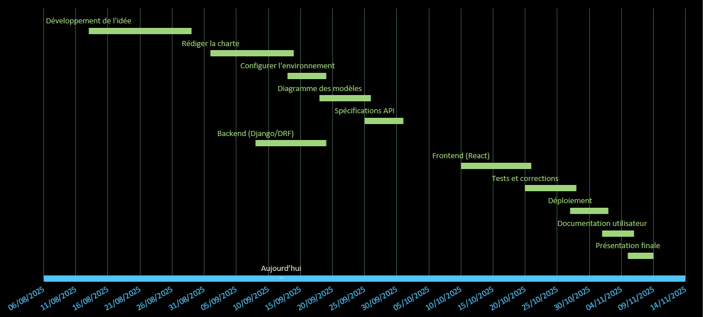

------

## 1. **Define Project Objectives**

### **Project Purpose**

Create a responsive and accessible web and mobile application to manage fish production across two aquaculture sites. The application will allow the creation of fish batches and the recording of feedings. The goal is to improve traceability, efficiency, and data management to optimize production.

### **SMART Objectives**

| Objective                 | Specific                            | Measurable                                      | Achievable                                      | Realistic                             | Timeframe |
| ------------------------- | ----------------------------------- | ----------------------------------------------- | ----------------------------------------------- | ------------------------------------- | --------- |
| Create sites and ponds    | 2 sites, max 14 ponds per site.     | 100% of sites/ponds created in the application. | Simple Django model + React form.               | Top priority for the MVP.             | Week 1    |
| Create and assign batches | Batch = species + quantity + pond   | 10 batches created and assigned.                | ForeignKey relationship between Batch and Pond. | Validated by the aquaculture manager. | Week 1-2  |
| Record feedings           | Feed + quantity + batch + date/time | 50 feedings recorded.                           | React form + Django Rest Framework endpoint.    | Core of the project.                  | Week 2-3  |
| Basic authentication      | Email/password.                     | 3 test users created.                           | Use `dj-rest-auth`.                             | No complex roles for the MVP.         | Week 1    |

------

## 2. **Identify Stakeholders and Team Roles**

| Type         | Name/Role                 | Responsibilities                                             | Contact/Notes                      |
| ------------ | ------------------------- | ------------------------------------------------------------ | ---------------------------------- |
| **Internal** | Anne-Cécile Colléter      | **Project Manager**: Planning, deadline tracking, task prioritization. |                                    |
|              |                           | **Full-Stack Developer**: Backend (Django/PostgreSQL), Frontend (React), Docker, testing, deployment. |                                    |
|              |                           | **UX/UI Design**: Interface mockups (feedings, records, dashboard). | Tools: Figma or paper sketches.    |
| **Internal** | Holberton Tutor Axel Goré | Validate technical deliverables, provide code feedback, methodological support. | Holberton platform/Slack.          |
| **External** | Aquaculture Manager       | Provide business processes (e.g., frequency of records), validate application usability. | Available for regular check-ins.   |
| **External** | Site Employees            | End-users: Test the application in real conditions, report bugs. | Access to a test version from MVP. |

------

## 3. **Define Project Scope**

| In-Scope                               | Out-of-Scope                           |
| -------------------------------------- | -------------------------------------- |
| Create/modify sites and ponds.         | Client, supplier, or sales management. |
| Create/modify batches and assign them. | Temperature/oxygen level records.      |
| Record feedings (batch + feed).        | Alerts, reports, or automatic sensors. |
| List feedings by batch.                | Advanced dashboards.                   |
| Email/password authentication.         | "Admin" or "manager" roles.            |

------

## 4. **Identify Risks and Mitigation Strategies**

| Risk                                  | Mitigation Strategy                                          |
| ------------------------------------- | ------------------------------------------------------------ |
| Development delays                    | Schedule weekly reviews to track progress and adjust timelines. |
| Lack of experience with Django/React  | Online training and mentorship from the tutor.               |
| Incorrect or incomplete data          | Implement automatic validations and user training.           |
| Frontend/Backend compatibility issues | Use well-documented REST APIs and regularly test integration. |
| Changes in user requirements          | Organize regular check-ins with users to validate features.  |

------

## 5. **Develop a High-Level Plan**

### **Gantt Chart**

