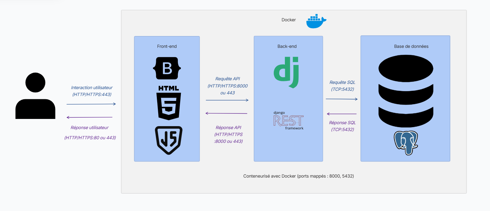

## 3. **Architecture du Système**

### 3.1**Diagramme d’architecture** :

L’utilisateur interagit avec une interface web (front-end) qui communique avec une API Django (back-end) pour lire/écrire des données dans PostgreSQL, le tout orchestré par Docker pour un déploiement simple et sécurisé.
