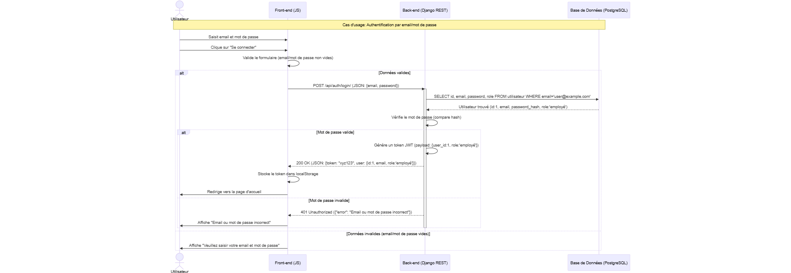

### 	7 **Diagrammes de Séquence**


#### 		7.1 **Diagramme de Séquence "Authentification d’un utilisateur":**



##### 	7.1.1 **Saisie des Identifiants**

- L'utilisateur saisit son **email** et son **mot de passe** dans un formulaire.
- Clique sur le bouton **"Se connecter"**.

##### 	7.1.2 **Validation Côté Front-end**

- Le front-end vérifie que l'email et le mot de passe ne sont pas vides.
- Si un champ est vide, un message d'erreur s'affiche immédiatement.

##### 	7.1..3 **Requête d'Authentification**

- Le front-end envoie une requête **POST** à `/api/auth/login/` avec les données :

  ```json
  {
      "email": "user@example.com",
      "password": "motdepasse123"
  }
  ```

#####

##### 	7.1.4 **Vérification en Base de Données**

- Le back-end recherche l'utilisateur par email :

  ```postgresql
  SELECT id, email, password, role FROM utilisateur WHERE email='user@example.com';
  ```

- Si l'utilisateur n'existe pas, renvoie une erreur **401 Unauthorized**.


##### 	7.1.5 **Vérification du Mot de Passe**

- Le back-end compare le mot de passe fourni avec le **hash stocké** en base (via `check_password` de Django).
- Si le mot de passe est invalide, renvoie une erreur **401 Unauthorized**.

##### 	7.1.6 **Génération du Token JWT**

- Si l'authentification réussit, le back-end génère un **token JWT** contenant :
  - `user_id`: 1
  - `role`: "employé" (ou "gérant"/"admin")
  - `exp`: date d'expiration (ex: +24h).

##### 	7.1.7 **Réponse et Stockage du Token**

- Le back-end renvoie le token et les informations utilisateur :

  ```json
  {
      "token": "xyz123.abc456.def789",
      "user": {
          "id": 1,
          "email": "user@example.com",
          "role": "employé"
      }
  }
  ```

- Le front-end stocke le token dans `localStorage` et redirige l'utilisateur vers la page d'accueil.

##### 	7.1.8 **Gestion des Erreurs**

- **Email/mot de passe vides** : Message d'erreur côté front-end.

- **Email/mot de passe invalides** : Erreur **401 Unauthorized** côté back-end.

  ---


#### 7.2 **Diagramme de Séquence "Enregistrement d'un repas"**


1. ##### **Sélection du Site**

   - L’utilisateur choisit un **site** (ex: "Site de la Vallée").
   - Le front-end demande au back-end la **liste des bassins** associés à ce site via une requête `GET /api/sites/{site_id}/bassins/`.

2. ##### **Affichage des Bassins**

   - Le back-end vérifie les **autorisations** (token JWT valide) et retourne la liste des bassins disponibles.
   - L’utilisateur voit les bassins dans un menu déroulant et en sélectionne un (ex: "Bassin A").

3. ##### **Saisie des Données**

   - L’utilisateur remplit le formulaire :
     - **Type d’aliment** (ex: "granulés").
     - **Quantité distribuée** (ex: 500g).
   - Il clique sur **"Valider"** pour soumettre le formulaire.

4. ##### **Validation Front-end**

   - Le front-end vérifie que les données sont valides (ex: quantité > 0, aliment sélectionné).
   - **Si invalide** : Affiche un message d’erreur (ex: "Veuillez saisir la quantité").
   - **Si valide** : Envoie les données au back-end via une requête `POST /api/nourrissages/`.

5. ##### **Traitement Back-end**

   - Le back-end :
     1. Vérifie le **token JWT** et les **permissions** de l’utilisateur.
     2. Confirme que le bassin sélectionné existe et est accessible à l’utilisateur.
     3. **Si accès refusé** : Retourne une erreur **403 Forbidden** ("Accès refusé à ce bassin").
     4. **Si accès autorisé** : Enregistre le nourrissage en base de données.

6. ##### **Confirmation**

   - Le back-end retourne une **réponse 201 Created** avec les détails du nourrissage enregistré.
   - Le front-end affiche un message de succès à l’utilisateur : **"Nourrissage enregistré pour LOT-001"**.

