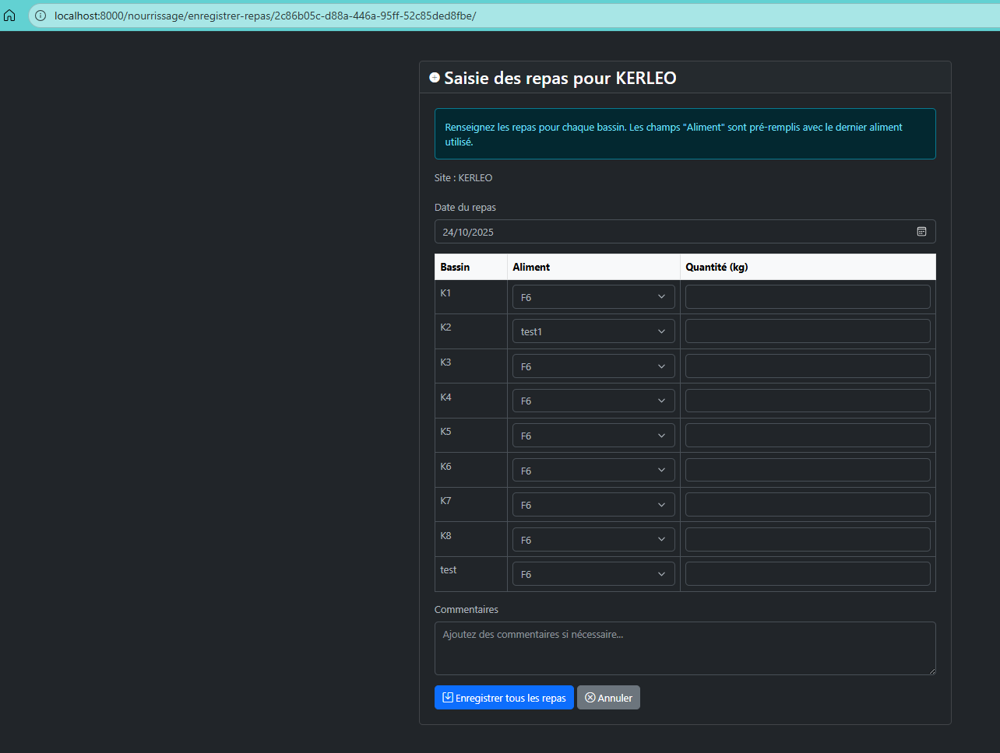

# Journal de Développement - Pisciculture

---

## **Sprint 1 : Core Functionality (2025-09-01 → 2025-09-14)**
### **Modèles de Base (Site, Bassin, Espece)**
- **Commit** : [30b8c63](https://github.com/AnneCecile2935/pisciculture/commit/30b8c63)
- **Fichiers modifiés** :
  - `apps/sites/models.py` (Site, Bassin)
- **Description** :
  - Création des modèles `Site`, `Bassin`, `Espece`, et avec relations ForeignKey.
  - Configuration basique de l’admin pour `Site` et `Bassin`.
- **Blocage** : Conflits de migration initiaux.
  **Solution** : Réinitialisation des migrations et correction des champs (`python manage.py makemigrations --merge`).
  **Preuve** : [f4849cc](https://github.com/AnneCecile2935/pisciculture/commit/f4849cc).

### **Modèle LotDePoisson**
- **Commit** : [b5c8cc2](https://github.com/AnneCecile2935/pisciculture/commit/b5c8cc2)
- **Fichiers modifiés** :
  - `apps/stocks/models.py` (LotDePoisson)
- **Description** :
  - Ajout du modèle avec calcul automatique du poids moyen.
  - Relation vers `Bassin` et `Espece`.

### **Modèle Aliment et Fournisseur**
- **Commit** : [c693e75](https://github.com/AnneCecile2935/pisciculture/commit/c693e75)
- **Fichiers modifiés** :
  - `apps/stocks/models.py` (Aliment, StockAliment)
  - `apps/fournisseurs/models.py` (Fournisseur)
- **Description** :
  - Modèle `Aliment` avec validation des quantités.
  - Relation vers `Fournisseur`.

---

## **Sprint 2 : Nourrissage et Interface Utilisateur (2025-09-15 → 2025-09-28)**
### **Modèle et Formulaire Nourrissage**
- **Commit** : [8b4678e](https://github.com/AnneCecile2935/pisciculture/commit/8b4678e)
- **Fichiers modifiés** :
  - `apps/activité_quotidien/models.py` (Nourrissage)
  - `apps/activité_quotidien/forms.py` (NourrissageForm)
- **Description** :
  - Modèle pour enregistrer les repas par bassin.
  - Formulaire de base pour la saisie.
- **Capture d’écran** :
  

### **Intégration de DataTables**
- **Commit** : [868d3af](https://github.com/AnneCecile2935/pisciculture/commit/868d3af)
- **Fichiers modifiés** :
  - `templates/activité_quotidien/nourrissage_list.html`
  - `static/js/datatables_init.js`
- **Description** :
  - Migration des listes statiques vers DataTables (AJAX, pagination, tri).
  - Correction des templates pour afficher les données dynamiquement.
- **Blocage** : Affichage incorrect des données.
  **Solution** : Correction des colonnes et des appels AJAX.
  **Preuve** : [260e0cf](https://github.com/AnneCecile2935/pisciculture/commit/260e0cf).

---

## **Sprint 3 : Améliorations et Tests (2025-09-29 → 2025-10-12)**
### **Formulaire Global par Site**
- **Commit** : [93a9eb9](https://github.com/AnneCecile2935/pisciculture/commit/93a9eb9)
- **Fichiers modifiés** :
  - `apps/activité_quotidien/forms.py` (GlobalNourrissageForm)
  - `templates/activité_quotidien/nourrissage_global_form.html`
- **Description** :
  - Formulaire pour saisir les repas **pour tous les bassins d’un site** en une seule fois.
  - Logique JS pour calculer les totaux.
- **Capture d’écran** :
  

### **Tests Unitaires et d’Intégration**
- **Commit** : [0f2fa07](https://github.com/AnneCecile2935/pisciculture/commit/0f2fa07)
- **Fichiers modifiés** :
  - `tests/activité_quotidien/test_nourrissage.py`
- **Description** :
  - Tests pour la création, la validation et l’affichage des nourrissages.
  - Couverture à 100% avec `pytest --cov`.
- **Résultat des tests** :
  ```bash
  === 8 tests passed in 1.2s (100% coverage) ===
