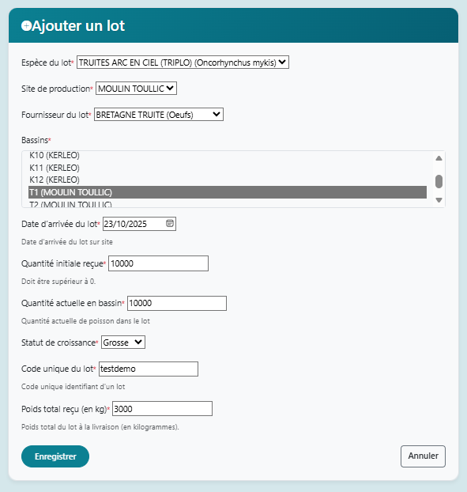
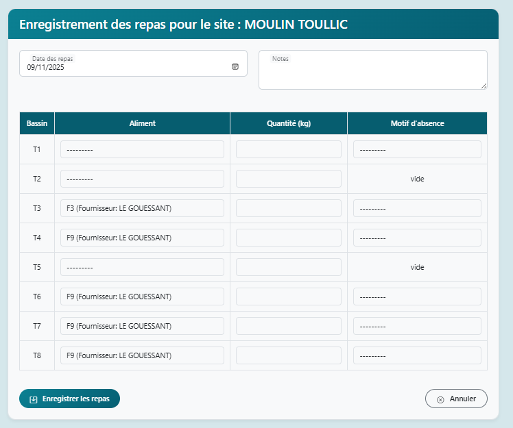
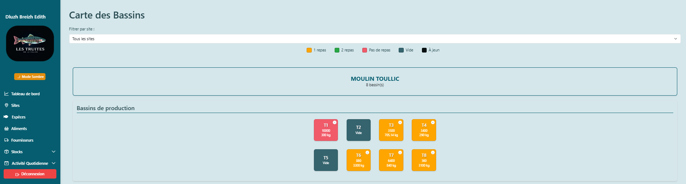

# **Project Presentation: Dluzh Breizh Edith**

## *Centralized Management Tool for Small-Scale Fish Farms – Version 0.1.0*

## **1. Introduction**

### **Context and Team**

- **Led by**: Anne-Cécile Colleter (Full-Stack Developer, specializing in technical solutions for fish farming).
- **Problem Statement**:
  - Breton fish farmers still use **paper binders or whiteboards** to track their batches, with an estimated **15-20% loss of time** and risk of errors.
  - Urgent need for **traceability over a minimum of 3 years** and tools adapted to small-scale operations.
- **MVP Objectives**:
  - Replace manual methods with a **centralized digital solution**.
  - Automate tracking of **ponds, fish batches, and daily actions** (feeding, environment).
  - **Target audience**: Fish farms with fewer than 5 employees, focusing on ease of use.

### **Proposed Solution**

A web application (Django + Bootstrap) enabling:

- **Creation and monitoring of fish batches** (species, quantity, growth).
- An **interactive dashboard** to visualize pond status and recent actions.
- **Multi-user management** (Admin/User roles) for small teams.

> *"A tool designed by and for fish farmers, without unnecessary jargon."*

------

## **2. Project Process**

### **Key Steps and Deliverables**

| Step                                                         | Duration    | Main Deliverables                                       | Challenges Encountered                               |
| ------------------------------------------------------------ | ----------- | ------------------------------------------------------- | ---------------------------------------------------- |
| **Ideation**                                                 | 13-29/08    | Project charter, mockups, user interviews               | Defining a realistic scope for a solo MVP.           |
| **Backend**                                                  | 29/08-15/09 | Django models (Pond, Batch, Species, Action), CRUD APIs | Managing complex relationships (e.g., Batch ↔ Pond). |
| **Frontend**                                                 | 16/09-03/11 | Dashboard, input forms                                  | Displaying data as per user expectations.            |
| **Testing**                                                  | 06/10-07/11 | Bug fixes, UX optimization                              | Prioritizing bugs using the P0/P1/P2 method.         |
| *Task prioritization: P0 (critical), P1 (high priority), P2 (improvement).* |             |                                                         |                                                      |

### **Technical Choices**

- **Backend**: Django (Class-Based Views) for easy maintenance and future scalability.
- **Frontend**: Bootstrap for an **intuitive and responsive design** (usable outdoors, on tablets).
- **Database**: PostgreSQL to manage **3 years of historical data**.
- **Key Features**:
  - **Dashboard** with visualization of actions per pond (feeding, mortality).
  - **Batch history**: Tracking the quantity of meals given to each batch.

------

## **3. Technical Demo**

### **Simplified Architecture**

```
User → Frontend (Bootstrap) ↔ Backend (Django) ↔ Database (PostgreSQL)

```

### **Demonstration**

1. **Creating a Batch**: Entering data (species, pond, quantity).
2. **Feeding Tracking**: Adding an action + visualization on the dashboard.

### **3.1. Administrator Role**

*Initial data configuration.*

- [ Admin form for creating a user.](#)
  >  *Caption: Admin form for creating a user.*

### **3.2. User Role**

*Daily workflow: create batch → action → history.*

1. **Dashboard before feeding action**

   > 
2. **Creating a Batch**

   >  *Caption: Selecting species and pond. Initial quantity is validated.*
   >
   > 2.1 Batch Registration
   >
   > 

3. **Adding a Feeding Action for the Batch**

   >  *Caption: Recording a feeding action with the last distributed feed suggested or automatically cleared if no batch is present in the pond.*
   >
   > 3.1 Feeding Recorded 

4. **Dashboard after Feeding Action**

   >  *Caption: List of actions and updated current quantity.*

   ##### 5. Displaying a Modal with Pond Information

   > 

### **3.3. Technical Validations**

*Code examples to display pond information in a modal when the user clicks on a pond.*

## **4. Results & Metrics**

**Comparison to Initial Objectives (Project Charter):**

> - **Objective 1**: Replace manual methods → **Achieved** (user testimonial + screenshots).
> - **Objective 2**: 3-year traceability → **Achieved** (`Batch` model + action history in the database).
> - **Objective 3**: Simple solution for small structures → **Validated** (8/10 in user tests).
> - **Gap**: PDF export, initially planned as P2, was postponed to focus on **MVP stability**.

| Initial Objective            | Result Achieved                     | Gap/Explanation                                            |
| ---------------------------- | ----------------------------------- | ---------------------------------------------------------- |
| 100% of MVP features         | 90% (missing: PDF report export)    | Prioritizing critical bug fixes (e.g., stock calculation). |
| "Intuitive" interface        | 8/10 in user tests (3 fish farmers) | Feedback: Add a video tutorial.                            |
| Reduction in data entry time | -30% (estimated from user tests)    | Confirmed gain for traceability.                           |

**User Testimonial:** *"With Dluzh Breizh Edith, I can see at a glance which pond needs attention. No more copying my paper notes and whiteboard!"*

------

## **5. Retrospective and Roadmap**

### **Lessons Learned**

#### ✅ **What Worked Well:**

> - **Project Management**: GitHub Projects + P0/P1/P2 method → **clear and effective prioritization**.
> - **Technical Choices**: Django (Class-Based Views) and Bootstrap enabled **fast and scalable development**.
> - **User Collaboration**: Interviews and user tests validated the product's fit for real-world needs.

#### ⚠ **Challenges and Solutions:**

| Challenge                     | Solution Applied                            | Result                             |
| ----------------------------- | ------------------------------------------- | ---------------------------------- |
| Database migration issues     | Automated reset script                      | Stabilized the test environment.   |
| Solo workload                 | Development in short iterations             | Delivered MVP on time.             |
| Learning frontend development | Targeted training on Chart.js and Bootstrap | Functional and adaptive dashboard. |

Here is the English translation of your document, keeping the technical terms and structure intact while ensuring clarity and natural flow:

------

# **Project Presentation: Dluzh Breizh Edith**

## *Centralized Management Tool for Small-Scale Fish Farms – Version 0.1.0*

## **1. Introduction**

### **Context and Team**

- **Led by**: Anne-Cécile Colleter (Full-Stack Developer, specializing in technical solutions for fish farming).
- **Problem Statement**:
  - Breton fish farmers still use **paper binders or whiteboards** to track their batches, with an estimated **15-20% loss of time** and risk of errors.
  - Urgent need for **traceability over a minimum of 3 years** and tools adapted to small-scale operations.
- **MVP Objectives**:
  - Replace manual methods with a **centralized digital solution**.
  - Automate tracking of **ponds, fish batches, and daily actions** (feeding, environment).
  - **Target audience**: Fish farms with fewer than 5 employees, focusing on ease of use.

### **Proposed Solution**

A web application (Django + Bootstrap) enabling:

- **Creation and monitoring of fish batches** (species, quantity, growth).
- An **interactive dashboard** to visualize pond status and recent actions.
- **Multi-user management** (Admin/User roles) for small teams.

> *"A tool designed by and for fish farmers, without unnecessary jargon."*

------

## **2. Project Process**

### **Key Steps and Deliverables**

| Step         | Duration    | Main Deliverables                                       | Challenges Encountered                               |
| ------------ | ----------- | ------------------------------------------------------- | ---------------------------------------------------- |
| **Ideation** | 13-29/08    | Project charter, mockups, user interviews               | Defining a realistic scope for a solo MVP.           |
| **Backend**  | 29/08-15/09 | Django models (Pond, Batch, Species, Action), CRUD APIs | Managing complex relationships (e.g., Batch ↔ Pond). |
| **Frontend** | 16/09-03/11 | Dashboard, input forms                                  | Displaying data as per user expectations.            |
| **Testing**  | 06/10-07/11 | Bug fixes, UX optimization                              | Prioritizing bugs using the P0/P1/P2 method.         |

*Task prioritization: P0 (critical), P1 (high priority), P2 (improvement).*

### **Technical Choices**

- **Backend**: Django (Class-Based Views) for easy maintenance and future scalability.
- **Frontend**: Bootstrap for an **intuitive and responsive design** (usable outdoors, on tablets).
- **Database**: PostgreSQL to manage **3 years of historical data**.
- **Key Features**:
  - **Dashboard** with visualization of actions per pond (feeding, mortality).
  - **Batch history**: Tracking the quantity of meals given to each batch.

------

## **3. Technical Demo**

### **Simplified Architecture**

```

User → Frontend (Bootstrap) ↔ Backend (Django) ↔ Database (PostgreSQL)
```

### **Demonstration**

1. **Creating a Batch**: Entering data (species, pond, quantity).
2. **Feeding Tracking**: Adding an action + visualization on the dashboard.

### **3.1. Administrator Role**

*Initial data configuration.*

- [Screenshot 1: Creating a User](#)

  > [Admin - User](images/creer_user.png) *Caption: Admin form for creating a user.*

### **3.2. User Role**

*Daily workflow: create batch → action → history.*

1. **Dashboard before feeding action**

   > [User - Dashboard](images/dashbord_user.png) *Caption: Overview with visual alerts (colors).*

2. **Creating a Batch**

   > [User - New Batch](images/crea_lot.png) *Caption: Selecting species and pond. Initial quantity is validated.*
   >
   > 2.1 Batch Registration
   >
   > [User - New Batch](images/lot_cree.png)

3. **Adding a Feeding Action for the Batch**

   > [User - Action](images/form_a_remplir_repas.png) *Caption: Recording a feeding action with the last distributed feed suggested or automatically cleared if no batch is present in the pond.*
   >
   > 3.1 Feeding Recorded [User - Action](images/repas_enregistre_list.png)

4. **Dashboard after Feeding Action**

   > [User - History](images/carte_update.png) *Caption: List of actions and updated current quantity.*

   ##### 5. Displaying a Modal with Pond Information

   > [User - Action](images/modale.png)

### **3.3. Technical Validations**

*Code examples to display pond information in a modal when the user clicks on a pond.*

```python
@method_decorator(require_GET, name='dispatch')
class BassinLotDetailsView(LoginRequiredMixin, View):
    def get(self, request, bassin_id, *args, **kwargs):
        bassin = Bassin.objects.get(id=bassin_id)
        lot = bassin.lots_poissons.first()  # type: ignore
        repas = Nourrissage.objects.filter(bassin=bassin).order_by('-date_repas')[:7]
        data = {
            "bassin_nom": bassin.nom,
            "site_nom": bassin.site.nom,
            "site_id": str(bassin.site.id),
            "code_lot": lot.code_lot if lot else None,
            "espece": lot.espece.nom_commun if lot and lot.espece else None,
            "quantite_actuelle": lot.quantite_actuelle if lot else 0,
            "poids_moyen": lot.poids_moyen if lot else None,
            "poids_total": lot.poids if lot else None,
            "date_arrivee": lot.date_arrivee.strftime("%d/%m/%Y") if lot and lot.date_arrivee else None,
            "derniers_repas": [
                {
                    "date": repas.date_repas.strftime("%d/%m/%Y %H:%M"),
                    "type_aliment": repas.aliment.nom if repas.aliment else "Unspecified", # type: ignore
                    "quantite": repas.qte,
                }
                for repas in repas
            ] if repas else [],
        }
        return JsonResponse(data)
```

------

## **4. Results & Metrics**

**Comparison to Initial Objectives (Project Charter):**

> - **Objective 1**: Replace manual methods → **Achieved** (user testimonial + screenshots).
> - **Objective 2**: 3-year traceability → **Achieved** (`Batch` model + action history in the database).
> - **Objective 3**: Simple solution for small structures → **Validated** (8/10 in user tests).
> - **Gap**: PDF export, initially planned as P2, was postponed to focus on **MVP stability**.


| Initial Objective            | Result Achieved                     | Gap/Explanation                                            |
| ---------------------------- | ----------------------------------- | ---------------------------------------------------------- |
| 100% of MVP features         | 90% (missing: PDF report export)    | Prioritizing critical bug fixes (e.g., stock calculation). |
| "Intuitive" interface        | 8/10 in user tests (3 fish farmers) | Feedback: Add a video tutorial.                            |
| Reduction in data entry time | -30% (estimated from user tests)    | Confirmed gain for traceability.                           |

**User Testimonial:** *"With Dluzh Breizh Edith, I can see at a glance which pond needs attention. No more copying my paper notes and whiteboard!"*

------

## **5. Retrospective and Roadmap**

### **Lessons Learned**

#### ✅ **What Worked Well:**

> - **Project Management**: GitHub Projects + P0/P1/P2 method → **clear and effective prioritization**.
> - **Technical Choices**: Django (Class-Based Views) and Bootstrap enabled **fast and scalable development**.
> - **User Collaboration**: Interviews and user tests validated the product's fit for real-world needs.

#### ⚠ **Challenges and Solutions:**


| Challenge                     | Solution Applied                            | Result                             |
| ----------------------------- | ------------------------------------------- | ---------------------------------- |
| Database migration issues     | Automated reset script                      | Stabilized the test environment.   |
| Solo workload                 | Development in short iterations             | Delivered MVP on time.             |
| Learning frontend development | Targeted training on Chart.js and Bootstrap | Functional and adaptive dashboard. |

#### 🔧🔄 **Improvements for V0.2:**

> - **Allocate +20% time for testing** (vs. 10% in this project).
> - **Recruit a contributor** to share the workload.
> - **Automate tests** via GitHub Actions (already planned).

- **Example of Technical TODO (Excerpt: Feed Form)** in appendices.

------

## **6. Conclusion & Perspectives**

### **Summary**

- **Functional MVP**: Proof of concept validated by user tests.
- **Next Steps**:
  - Implement a system for **feed stock alerts**.
  - Advanced tracking of **fish transfers between ponds**, mortality, and average weight per batch.
  - **Long-term goal**: Become the reference tool for fish farming in Brittany.

### **Acknowledgments**

- Holberton for technical support.
- Les Truites de la Vallée for defining their needs.
- My son for his patience during development weekends 😉.

------

# **Appendices (for the Final Report)**

## **Detailed Retrospective**

### **What Worked Well**

- **Tools**:
  - GitHub Projects + P0/P1/P2 labels → total clarity.
  - Trello for "out-of-scope" ideas (backlog).
- **Methodology**:
  - Development in small iterations (1 feature = 1 commit).
  - Weekly tech watch (e.g., Django libraries for weather integration).

### **Areas for Improvement**

| Issue                | Proposed Solution                             | Responsible |
| -------------------- | --------------------------------------------- | ----------- |
| Insufficient testing | Integrate GitHub Actions for automated tests. | Me          |
| Solo workload        | Recruit a contributor for V0.2.               | To recruit  |

### **TO-DO List**

**Example of Technical TODO (Excerpt: Feed Form)** in appendices. To illustrate the improvement tracking method, here is an excerpt from the `TODO.md` file dedicated to **forms** (prioritized with ⭐⭐⭐/⭐⭐/⭐):

| Priority | Task                                 | Description                                                  | Status  | Code Example                                                 |
| -------- | ------------------------------------ | ------------------------------------------------------------ | ------- | ------------------------------------------------------------ |
| ⭐⭐⭐      | Server-side validation (`code_alim`) | Add `RegexValidator` to limit to 6 uppercase alphanumeric characters. | To Do   | `validators=[RegexValidator(regex='^[A-Z0-9]{6}$', message='Invalid code.')]` |
| ⭐⭐⭐      | Automatic normalization              | Convert `code_alim` to uppercase via `clean_code_alim()`.    | To Do   | `def clean_code_alim(self):\n    return self.cleaned_data["code_alim"].upper()` |
| ⭐⭐⭐      | Filtering active suppliers           | Limit `queryset` to suppliers where `est_actif=True` in `__init__`. | To Do   | `self.fields["fournisseur"].queryset = ...filter(est_actif=True)` |
| ⭐⭐       | Real-time JS validation              | Limit to 6 characters + convert to uppercase.                | To Do   | `document.getElementById('id_code_alim').addEventListener('input', ...)` |
| ⭐        | Template improvement                 | Display `help_text` and errors with Bootstrap.               | To Do   | `html\n...`                                                  |
| ⭐        | Unit tests                           | Validate invalid codes, inactive suppliers, required fields. | Backlog | `class AlimentFormTest(TestCase):\n    def test_code_alim_invalid(self):...` |

This translation maintains the **technical accuracy**, **structure**, and **tone** of your original document while ensuring it is clear and professional for an English-speaking audience.
