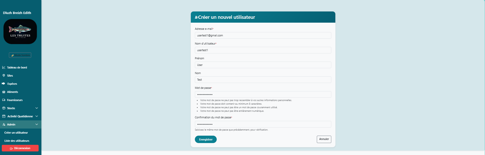
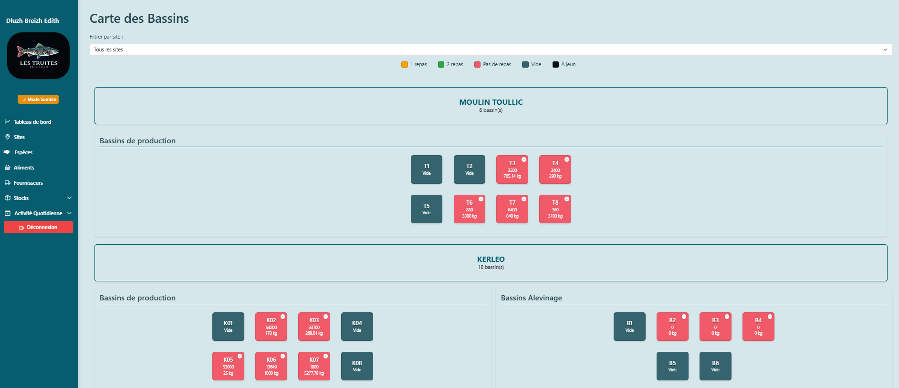
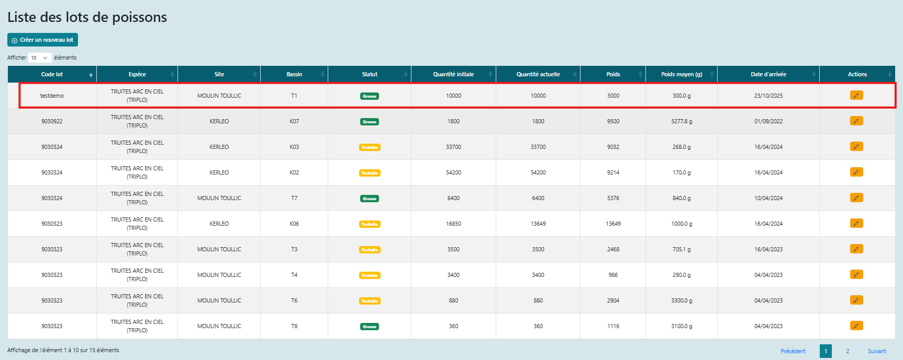
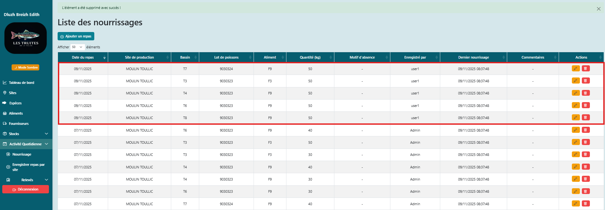

# Présentation du Projet : Dluzh Breizh Edith
*Outil de gestion centralisée pour les petites entreprises piscicoles – Version 0.1.0*

---

## **1. Introduction**
### **Contexte et Équipe**
- **Porté par** : Anne-Cécile Colleter (développeuse full-stack, spécialisation en solutions techniques pour la pisciculture).
- **Problématique** :
  - Les pisciculteurs bretons utilisent encore des **classeurs papier ou tableaux velleda** pour suivre leurs lots, avec des risques d’erreurs et une perte de temps estimée à **15-20%**.
  - Besoin criant de **traçabilité sur minimum sur 3 ans** et d’outils adaptés aux petites structures.
- **Objectifs du MVP** :
  - Remplacer les méthodes manuelles par une **solution numérique centralisée**.
  - Automatiser le suivi des **bassins, lots de poissons, et actions quotidiennes** (alimentation, environnement).
  - **Cible** : Piscicultures de moins de 5 salariés, avec un focus sur la simplicité d’utilisation.

### **Solution proposée**
Une application web (Django + Bootstrap) permettant :
- La **création et le suivi des lots** (espèces, quantité, croissance).
- Un **tableau de bord interactif** pour visualiser l’état des bassins et les actions récentes.
- Une **gestion multi-utilisateurs** (rôles Admin/User) pour les équipes réduites.

> *"Un outil conçu par et pour les pisciculteurs, sans jargon superflu."*

---

## **2. Processus du Projet**
### **Étapes clés et Livrables**
| Étape        | Durée       | Livrables principaux                                    | Défis rencontrés                                    |
| ------------ | ----------- | ------------------------------------------------------- | --------------------------------------------------- |
| **Idéation** | 13-29/08    | Charte projet, maquettes, interviews utilisateurs       | Définir un scope réaliste pour un MVP solo.         |
| **Backend**  | 29/08-15/09 | Modèles Django (Bassin, Lot, Espèce, Action), APIs CRUD | Gestion des relations complexes (ex: Lot ↔ Bassin). |
| **Frontend** | 16/09-03/11 | Tableau de bord, formulaires de saisie                  | Affichage conforme aux attentes suivant conditions  |
| **Tests**    | 06/10-07/11 | Correction de bugs, optimisation UX                     | Priorisation des bugs avec la méthode P0/P1/P2.     |

*Priorisation des tâches : P0 (critique), P1 (haute priorité), P2 (amélioration)."*

### **Choix techniques**

- **Backend** : Django (Class-Based Views) pour une maintenance facile et une scalabilité future.
- **Frontend** : Bootstrap pour un design **intuitif et adaptatif** (utilisable en extérieur, sur tablette).
- **Base de données** : PostgreSQL pour gérer les **données historiques sur 3 ans**.
- **Fonctionnalité phare** :
  - **Tableau de bord** avec visualisation des actions par bassin (alimentation, mortalités).
  - **Historique des lots** : Suivi de la quantité de repas données à chaque lot.

---

## **3. Démo Technique**
### **Architecture simplifiée**
```plaintext
Utilisateur → Frontend (Bootstrap) ↔ Backend (Django) ↔ Base de données (PostgreSQL)
```

### **Démonstration**

1. **Création d’un lot** : Saisie des données (espèce, bassin, quantité).
2. **Suivi alimentaire** : Ajout d’une action + visualisation dans le tableau de bord.

### **3.1. Rôle Administrateur**
*Configuration initiale des données.*
- [Capture 1 : Création d’un utilisateur](#)
  > 
  > *Légende : Formulaire de création d'un User par l'admin*

### **3.2. Rôle Utilisateur**
*Workflow quotidien : création de lot → action → historique.*

1. **Tableau de bord avant action repas** 
   
   > 
   > *Légende : Vue d’ensemble avec alertes visuelles (couleurs).*
   
2. **Création d’un lot**
   > 
   >
   > *Légende : Sélection de l’espèce et du bassin. La quantité initiale est validée.*
   >
   > 2.1 Enregistrement du lot
   >
   > 
   
3. **Ajout d’une action repas du lot** 
   
   > 
   > *Légende : Enregistrement d’une alimentation avec proposition dernier aliment distribué ou vide automatique si aucun lot présent en bassin`.*
   >
   > 3.1 Enregistrement du repas
   
   
   
4. **Tableau de bord après action repas** 
   
   > 
   > *Légende : Liste des actions et quantité actuelle recalculée.*
   
   ##### 5. Affichage d'une modale avec les informations du bassin
   
   
   
   
   
   

### **3.3. Validations Techniques**
*Exemples de code pour afficher la modale du bassin avec les informations quand l'utilisateur clique sur un bassin.*

```python
@method_decorator(require_GET, name='dispatch')
class BassinLotDetailsView(LoginRequiredMixin, View):

    def get(self, request, bassin_id, *args, **kwargs):
        bassin = Bassin.objects.get(id=bassin_id)
        lot = bassin.lots_poissons.first()  # type: ignore
        repas = Nourrissage.objects.filter(bassin=bassin).order_by('-date_repas')[:7]

        data = {
            "bassin_nom": bassin.nom,
            "site_nom": bassin.site.nom,
            "site_id": str(bassin.site.id),
            "code_lot": lot.code_lot if lot else None,
            "espece": lot.espece.nom_commun if lot and lot.espece else None,
            "quantite_actuelle": lot.quantite_actuelle if lot else 0,
            "poids_moyen": lot.poids_moyen if lot else None,
            "poids_total": lot.poids if lot else None,
            "date_arrivee": lot.date_arrivee.strftime("%d/%m/%Y") if lot and lot.date_arrivee else None,
            "derniers_repas": [
                {
                    "date": repas.date_repas.strftime("%d/%m/%Y %H:%M"),
                    "type_aliment": repas.aliment.nom if repas.aliment else "Non spécifié", # type: ignore
                    "quantite": repas.qte,
                }
                for repas in repas
            ] if repas else [],
        }
        return JsonResponse(data)
```


------

## **4. Résultats & Métriques**


**Comparaison aux objectifs initiaux (Project Charter)** :

> - **Objectif 1** : Remplacer les méthodes manuelles → **Atteint** (témoignage utilisateur + captures d’écran).
> - **Objectif 2** : Traçabilité sur 3 ans → **Atteint** (modèle `Lot` + historique des actions en base).
> - **Objectif 3** : Solution simple pour petites structures → **Validé** (8/10 en tests utilisateurs).
> - **Écart** : L’export PDF, initialement prévu en P2, a été reporté pour se concentrer sur la **stabilité du MVP**.

| Objectif initial             | Résultat obtenu                            | Écart/Explication                                        |
| ---------------------------- | ------------------------------------------ | -------------------------------------------------------- |
| 100% des fonctionnalités MVP | 90% (manque : export PDF des rapports)     | Priorisation des bugs critiques (ex: calcul des stocks). |
| Interface "intuitive"        | 8/10 en test utilisateur (3 pisciculteurs) | Feedback : Ajouter un tutoriel vidéo.                    |
| Réduction du temps de saisie | -30% (estimé via tests utilisateurs)       | Gain confirmé pour la traçabilité.                       |

**Témoignage utilisateur** :

*"Avec Dluzh Breizh Edith, je vois en un coup d’œil quel bassin nécessite une attention particulière. Plus besoin de recopier mes notes papier et mon tableau Velleda!"* 


## **5. Rétrospective et feuille de route

### **Retour d’Expérience** 

### ✅ **Ce qui a bien fonctionné** :

> - **Gestion de projet** : GitHub Projects + méthode P0/P1/P2 → **clarté et priorisation efficace**.
> - **Choix techniques** : Django (Class-Based Views) et Bootstrap ont permis un développement **rapide et scalable**.
> - **Collaboration utilisateurs** : Les interviews et tests utilisateurs ont validé l’adéquation du produit aux besoins terrain.

### ⚠ **Défis et solutions** :

| Défi                         | Solution appliquée                         | Résultat                                  |
| ---------------------------- | ------------------------------------------ | ----------------------------------------- |
| Problèmes de migrations (DB) | Script de reset automatisé                 | Stabilisation de l’environnement de test. |
| Charge de travail solo       | Développement par itérations courtes       | Livraison du MVP dans les temps.          |
| Apprentissage du front-end   | Formation ciblée sur Chart.js et Bootstrap | Tableau de bord fonctionnel et adaptatif. |

### 🔧🔄 **Améliorations pour la V0.2** :

> - **Allouer +20% de temps aux tests** (vs 10% dans ce projet).
> - **Recruter un·e contributeur·rice** pour partager la charge.
> - **Automatiser les tests** via GitHub Actions (déjà planifié).

- **Exemple de TODO Technique (Extrait : Formulaire Aliment)** en annexes

  
  

------

## **6. Conclusion & Perspectives**

### **Bilan**

- **MVP fonctionnel** : Preuve de concept validée par les tests utilisateurs.
- **Prochaines étapes** :
  - Un système d’**alertes pour les ruptures de nourriture**.
  - Un suivi avancé des **transferts de poissons entre bassins**, de la mortalité et du poids moyen par lot."*
  - **Objectif long terme** : Devenir la référence des outils piscicoles en Bretagne.

### **Remerciements**

- Holberton pour l’accompagnement technique.
- Les Truites de la Vallée pour la définition de leur besoins.
- Mon fils pour sa patience pendant les weekends de dev 😉.


# **Annexes (pour le rapport final)**

## **Rétrospective détaillée**

### **Ce qui a bien fonctionné**

- **Outils** :
  - GitHub Projects + labels P0/P1/P2 → clarté totale.
  - Trello pour les idées "hors scope" (backlog).
- **Méthode** :
  - Développement par petites itérations (1 fonctionnalité = 1 commit).
  - Veilles techno hebdomadaires (ex: librairies Django pour la météo).

### **A améliorer**

| Problème               | Solution proposée                                    | Responsable |
| ---------------------- | ---------------------------------------------------- | ----------- |
| Tests insuffisants     | Intégrer GitHub Actions pour des tests automatiques. | Moi         |
| Charge de travail solo | Prévoir un·e contributeur·rice pour la V0.2.         | À recruter  |

### **TO DO **

**Exemple de TODO Technique (Extrait : Formulaire Aliment)** en annexes

Pour illustrer la méthode de suivi des améliorations, voici un extrait du fichier `TODO.md` dédié aux **formulaires** (priorisé avec ⭐⭐⭐/⭐⭐/⭐) :

| Priorité | Tâche                            | Description                                                  | Statut  | Code/Exemple                                                 |
| -------- | -------------------------------- | ------------------------------------------------------------ | ------- | ------------------------------------------------------------ |
| ⭐⭐⭐      | Validation serveur (`code_alim`) | Ajouter `RegexValidator` pour limiter à 6 caractères alphanumériques majuscules. | À faire | validators=[RegexValidator(regex='^[A-Z0-9]{6}$', message='Code invalide.')]` |
| ⭐⭐⭐      | Normalisation automatique        | Convertir `code_alim` en majuscules via `clean_code_alim()`. | À faire | def clean_code_alim(self):\n    return self.cleaned_data["code_alim"].upper()` |
| ⭐⭐⭐      | Filtrage des fournisseurs actifs | Limiter le `queryset` aux fournisseurs `est_actif=True` dans `__init__`. | À faire | `self.fields["fournisseur"].queryset = ...filter(est_actif=True)` |
| ⭐⭐⭐      | Validation JS en temps réel      | Limiter à 6 caractères + conversion en majuscules.           | À faire | `document.getElementById('id_code_alim').addEventListener('input', ...)` |
| ⭐⭐       | Amélioration du template         | Afficher `help_text` et erreurs avec Bootstrap.              | À faire | `html\n...`                                                  |
| ⭐        | Tests unitaires                  | Valider codes invalides, fournisseurs inactifs, champs obligatoires. | Backlog | class AlimentFormTest(TestCase):\n    def test_code_alim_invalid(self):...` |