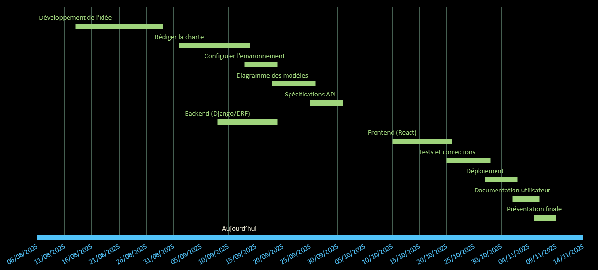

## 1. **Définir les objectifs du projet**

### **But du projet**

Créer une application web et mobile responsive et accessible pour gérer la production de poisson dans deux sites de pisciculture. L’application permettra de créer des lots et d’enregistrer les repas donnés aux poissons. L’objectif est d’améliorer la traçabilité, l’efficacité et la gestion des données pour optimiser la production.

### **Objectifs SMART**

1. | Objectif                     | Spécifique                             | Mesurable                                        | Atteignable                                        | Réaliste                                 | Temporel    |
   | ---------------------------- | -------------------------------------- | ------------------------------------------------ | -------------------------------------------------- | ---------------------------------------- | ----------- |
   | Créer des sites et bassins   | 2 sites, 14 bassins/site max.          | 100% des sites/bassins créés dans l’application. | Modèle Django simple + formulaire React.           | Priorité absolue pour le MVP.            | Semaine 1   |
   | Créer et assigner des lots   | Lot = espèce + quantité + bassin.      | 10 lots créés et assignés.                       | Relation ForeignKey entre Lot et Bassin.           | Validation par le responsable piscicole. | Semaine 1-2 |
   | Enregistrer des nourrissages | Aliment + quantité + lot + date/heure. | 50 nourrissages enregistrés.                     | Formulaire React + endpoint Django Rest Framework. | Coeur du projet.                         | Semaine 2-3 |
   | Authentification basique     | Email/mot de passe.                    | 3 utilisateurs test créés.                       | Utilisation de `dj-rest-auth`.                     | Pas de rôles complexes pour le MVP.      | Semaine 1   |

------

## 2. **Identifier les parties prenantes et les rôles de l’équipe**

| Type        | Nom/Rôle                        | Responsabilités                                              | Contact/Remarques                       |
| ----------- | ------------------------------- | ------------------------------------------------------------ | --------------------------------------- |
| **Interne** | Anne-Cécile Colléter            | **Chef de projet** : Planification, suivi des deadlines, priorisation des tâches. |                                         |
|             |                                 | **Développeuse Full-Stack** : Backend (Django/PostgreSQL), Frontend (React), Docker, tests, déploiement. |                                         |
|             |                                 | **Design UX/UI** : Maquettes des interfaces (nourrissages, relevés, tableau de bord). | Outils : Figma ou croquis papier.       |
| **Interne** | Tuteur Holberton Axel Goré | Validation des livrables techniques, feedback sur le code, soutien méthodologique. | Plateforme Holberton/Slack.             |
| **Externe** | Responsable piscicole           | Fournit les processus métiers (ex : fréquence des relevés), valide l’ergonomie de l’application. | Disponible pour des points réguliers.   |
| **Externe** | Employés des sites              | Utilisateurs finaux : testent l’application en conditions réelles, remontent les bugs. | Accès à une version de test dès le MVP. |

------

------

## 3. **Définir la portée du projet**

- | In-Scope                                      | Out-of-Scope                                 |
  | --------------------------------------------- | -------------------------------------------- |
  | Créer/modifier des sites et bassins.          | Gestion des clients, fournisseurs, ventes.   |
  | Créer/modifier des lots et les assigner.      | Relevés de température/oxygène.              |
  | Enregistrer des nourrissages (lot + aliment). | Alertes, rapports, ou capteurs automatiques. |
  | Lister les nourrissages par lot.              | Tableaux de bord avancés.                    |
  | Authentification par email/mot de passe.      | Rôles "admin" ou "gérant".                   |

------

## 4. **Identifier les risques et stratégies d’atténuation**

| Risque                                      | Stratégie d’atténuation                                      |
| ------------------------------------------- | ------------------------------------------------------------ |
| Retard dans le développement                | Planifier des revues hebdomadaires pour suivre l’avancement et ajuster les délais. |
| Manque d’expérience avec Django/React       | Formation en ligne et mentorat par le tuteur.                |
| Données incorrectes ou incomplètes          | Mettre en place des validations automatiques et des formations pour les utilisateurs. |
| Problèmes de compatibilité entre front/back | Utiliser des API REST bien documentées et tester régulièrement l’intégration. |
| Changement des besoins utilisateurs         | Organiser des points réguliers avec les utilisateurs pour valider les fonctionnalités. |

## 5. **Développer un plan de haut niveau**

### **Diagramme de Gantt**

