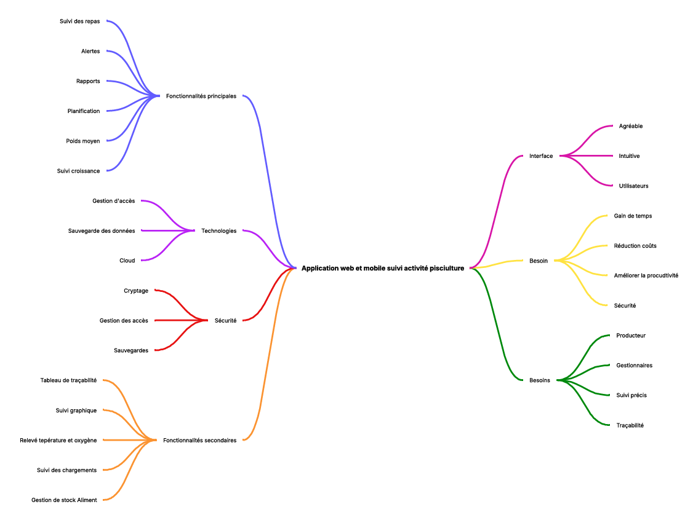

# Stage 1 Report: Idea Development (Individual Project)   

## 1. Project Presentation and Collaboration 

###   **📌 Project ID Card**

#### *Project: Web and Mobile Application for Fish Farming Activity Tracking*

| **👤 Participant**    | **🎯 Role**                             |
| -------------------- | -------------------------------------- |
| Anne-Cécile Colléter | Full-stack Developer & Project Manager |

---

#### *🛠 Tools Used*

| **Category**       | **Tool**              |
| ------------------ | --------------------- |
| Project Management | Trello(task tracking) |
| Communication      | Gmail                 |
| Version Control    | Github                |
| Development        | VS Code               |

#### **📋Work Standards:**

- ##### **Daily Trello updates**

- ##### **Daily Git commits**

- **🤝External  Collaboration:** 

  - **🏢Client:**  Fish farm SARL Truites de la Vallée
  - **💬Communication  Methods:** Bi-weekly meetings (🎥 Google Meet, 📧 email, 📞 phone)
  - **📅Exchange  Frequency:** 1 meeting every 2 weeks + 🔄 daily updates on shared Trello.

  ---

  

## 2. Research and Brainstorming

### **💡 Core Idea**

 Develop a **web and mobile application** to manage fish farming operations, including:

- Production sites and ponds.

- Feed types, meals, and feeding schedules. 
- Fish batches, transfers between ponds, and growth tracking. - 
- Feed and fish stock monitoring. 

---

### **🧠 Methods Used**

#### 

#### **Mind Mapping**

Visualized connections between key features:

- sites, ponds and stock management
- Feed tracking, growth monitoring, and alerts.

​         

---

#### **SCAMPER Framework**

####     

| **SCAMPER**            | **Idea/Question**                            | **Project Application**                                      |
| :--------------------- | :------------------------------------------- | :----------------------------------------------------------- |
| **S**ubstitute         | What can be replaced?                        | Replace manual notifications with automated mobile  alerts.  |
| **C**ombine            | Can elements be combined?                    | Combine feeding tracking with water quality/oxygen  monitoring in the same app. |
| **A**dapt              | Can an idea from another context be adapted? | Adapt agricultural production tracking systems for fish  feeding management. |
| **M**odify             | What can be modified/simplified?             | Redesign the interface to reduce clicks for recording  feedings. |
| **P**ut to another use | Can a feature be repurposed?                 | Use the feed tracking module to enhance fish batch  traceability. |
| **E**liminate          | What can be eliminated?                      | Eliminate repetitive manual data entry by automating  feeding schedules based on temperature. |
| **R**earrange          | Can the order/logic be reversed?             | Reverse the process: App auto-generates feeding schedules;  users validate. |

---

####  **“How Might We” Questions**

 

| **Identified Challenge**             | **HMW Question**                                             | **Solution Ideas**                                           |
| :----------------------------------- | ------------------------------------------------------------ | ------------------------------------------------------------ |
| Manual fish stock tracking           | How might we digitize fish  stock tracking to reduce errors? | Mobile app for  entries/exits, QR codes on ponds, IoT sensors for fish count/size. |
| Feeding management                   | How might we optimize  feeding tracking digitally?           | Automated feeding schedules,  missed-feeding alerts, consumption tracking per pond. |
| Sales and delivery  management       | How might we streamline  sales/deliveries with a digital tool? | Order dashboard, real-time  delivery tracking, customer notifications, auto-generated invoices. |
| Time-consuming  administrative tasks | How might we automate  administrative tasks to save time?    | Auto-generated reports,  centralized document storage, reminders for legal deadlines. |
| Production performance  analysis     | How might we easily  visualize/analyze production data?      | Interactive dashboard with  growth charts, survival rates, feed consumption, financial yield. |
| Team communication                   | How might we centralize  information/exchanges for all staff? | Internal messaging, action  alerts, shared calendar for tasks/appointments. |
| Anomaly detection                    | How might we quickly detect  production issues?              | Real-time sensor alerts  (temperature, oxygen, pH), smartphone/SMS notifications. |
| Tool adoption by staff               | How might we facilitate  digital tool adoption?              | Intuitive interface,  embedded tutorials, online support, gamification for best practices. |

---

#### **🔍 Explored Ideas**

| **Idea**                                             | **Strengths**                                                | **Weaknesses**                         | **Decision**                                                 |
| ---------------------------------------------------- | ------------------------------------------------------------ | -------------------------------------- | ------------------------------------------------------------ |
| **A: Digital Paper Log for Feeding**                 | Simple, quick to implement.                                  | Low innovation, risk of manual errors. | ❌ Rejected: Limited remote tracking.                         |
| **B: Web and Mobile App for Feeding/Stock Tracking** | Real-time tracking, automated alerts, comprehensive history. | Longer development time.               | ✅ **Selected**: High value for the client; improves traceability. \| |
| **C: Automated IoT Feeding System**                  | Full automation, reduces human error.                        | High cost, technical complexity.       | ❌ Rejected: Too complex for MVP; limited budget.             |

---

## 3. Idea Evaluation

### **📊Evaluation Criteria :**

-  Technical feasibility,
-  Client impact,    
- Cost, 
- Ease of use.

### **📈 Idea Comparison Table**

| **Idea**                             | **Feasibility** | **Impact** | **Cost** | **Simplicity** | **Total Score** |
| ------------------------------------ | --------------- | ---------- | -------- | -------------- | --------------- |
| **A: Digital Paper Log**             | 4/5             | 2/5        | 5/5      | 4/5            | 15/20           |
| **B: Web & Mobile App** *(Selected)* | **4/5**         | **5/5**    | **4/5**  | **4/5**        | **17/20**       |
| **C: Automated IoT System**          | 2/5             | 5/5        | 2/5      | 2/5            | 11/20           |

---

### **⚠️ Risks and Constraints**

| **Idea**                    | **Risks/Constraints**                                      |
| --------------------------- | ---------------------------------------------------------- |
| **A: Digital Paper Log**    | Low innovation, high risk of human errors.                 |
| **B: Web & Mobile App**     | Longer development time, requires regular client feedback. |
| **C: Automated IoT System** | High cost, technical complexity.                           |

## 4. Decision and Selected MVP

### **🏆 Chosen MVP**

**Solution :** **Web and mobile application for **feeding and stock tracking.

**Problem resolve:** Fish farmers waste time paper notes for stock, feed, transfers, and meals.

| **Aspect**            | **Details**                                                  |
| --------------------- | ------------------------------------------------------------ |
| **Target Users**      | Managers and employees of small/medium fish farms (1–2 sites, 5–20 ponds). |
| **Expected Outcomes** | Improved traceability, simplified tracking, reduced errors.  |

---

### **🔑 Key Features**

| **Feature**         | **Description**                                        |
| ------------------- | ------------------------------------------------------ |
| **User Management** | Admin and employee roles.                              |
| **Sites/Ponds**     | CRUD for sites and ponds (names, types).               |
| **Feed**            | CRUD for feed types (name, quantity, expiration date). |
| **Meals**           | Log meals (site, pond, feed type, quantity, date).     |
| **Batches**         | Create batches (origin, quantity, date, initial pond). |
| **Transfers**       | Transfer batches between ponds (with history).         |
| **Feed Stock**      | Track feed inventory (low-stock alerts).               |
| **Fish Stock**      | Monitor fish stock per pond.                           |

---

### **💡 Selection Rationale**

Balances **feasibility** and **impact**; innovative solution tailored for the client's needs.

---

### **🔧 Challenges and Opportunities**

| **Type**        | **Description**                                          | **Solution/Next Steps**                                      |
| --------------- | -------------------------------------------------------- | ------------------------------------------------------------ |
| **Challenge**   | Ensure data synchronization between web and mobile apps. | Use **Django REST Framework** for a shared API; offline-local cache for mobile. |
| **Opportunity** | Add predictive analytics/recommendations.                | Post-MVP enhancement.                                        |

---

### **🛠 Technologies**

| **Component** | **Technology**                                               |
| ------------- | ------------------------------------------------------------ |
| **Back-end**  | Django + PostgreSQL (robust for complex relationships; built-in admin). |
| **Front-end** | Bootstrap + JavaScript.                                      |
| **Hosting**   | Heroku or Railway.                                           |

---

## 5. Process Documentation

### **📝 Decision Summary**

After brainstorming and evaluation, the web/mobile app (Idea B) was selected for its

- **High value** for the client
- **Alignment with client needs** and technical feasibility.

---

### **🔄 All Ideas Considered** 

For a detailed overview of all explored ideas, refer to :

👉  [Section 2: “Explored Ideas”](#2-research-and-brainstorming)

---

### **📚 References**

| **Resource**           | **Link**                                                     |
| ---------------------- | ------------------------------------------------------------ |
| **SCAMPER Framework**  | [MindTools](https://www.mindtools.com/pages/article/newCT_02.htm) |
| **Mind Mapping Guide** | [MindMapping.com](https://www.mindmapping.com)               |

---

